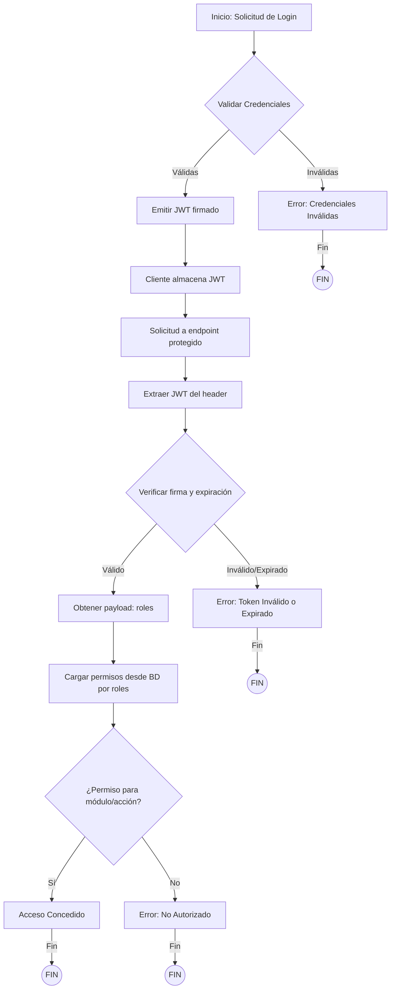

```mermaid
flowchart TD
  A[Inicio: Solicitud de Login] --> B{Validar Credenciales}
  B -- Válidas --> C[Emitir JWT firmado]
  B -- Inválidas --> R[Error: Credenciales Inválidas]
  C --> D[Cliente almacena JWT]
  D --> E[Solicitud a endpoint protegido]
  E --> F[Extraer JWT del header]
  F --> G{Verificar firma y expiración}
  G -- Válido --> H[Obtener payload: roles]
  G -- Inválido/Expirado --> R2[Error: Token Inválido o Expirado]
  H --> I[Cargar permisos desde BD por roles]
  I --> J{¿Permiso para módulo/acción?}
  J -- Sí --> S[Acceso Concedido]
  J -- No  --> R3[Error: No Autorizado]
  R -->|Fin| STOP1((FIN))
  R2 -->|Fin| STOP2((FIN))
  R3 -->|Fin| STOP3((FIN))
  S -->|Fin| STOP4((FIN))
```